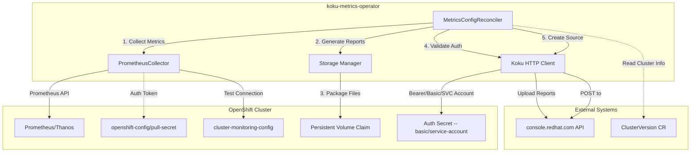
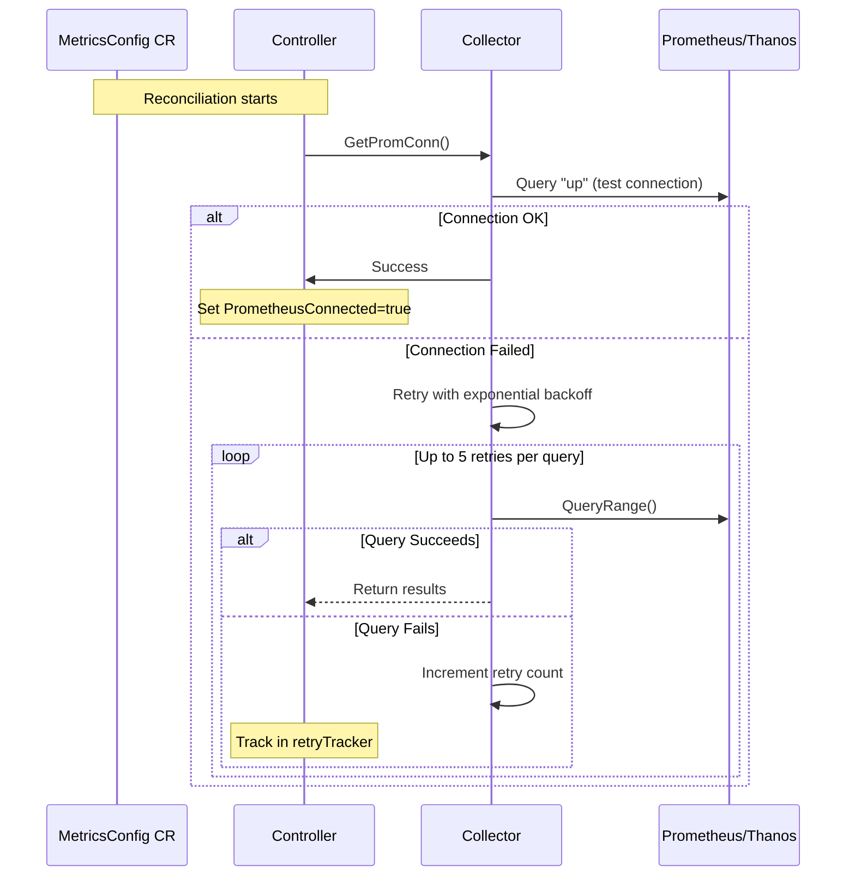
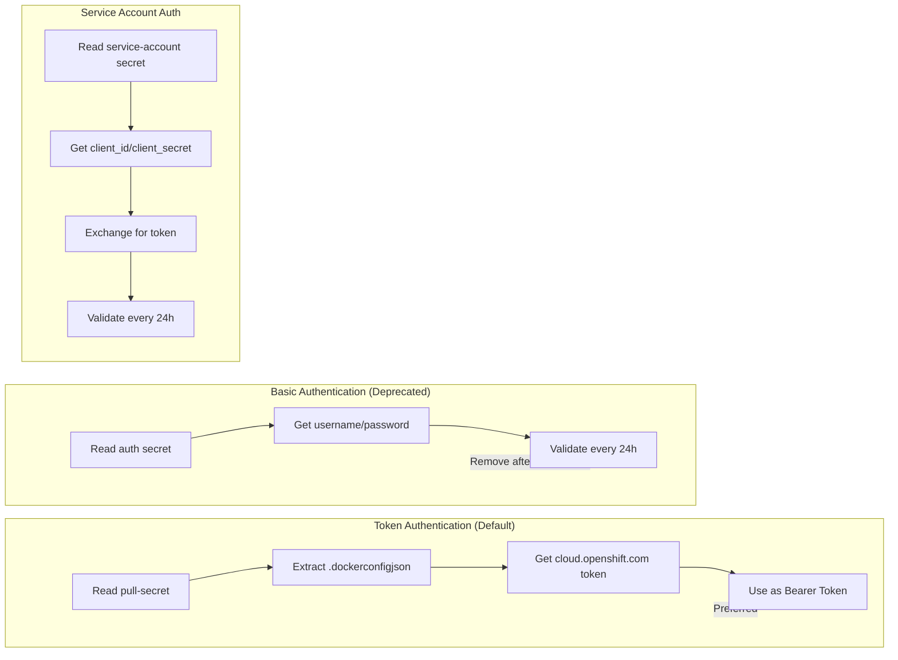
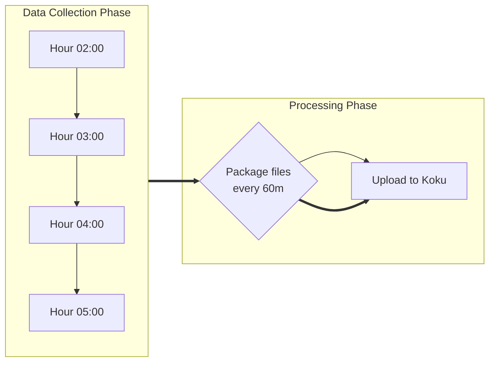
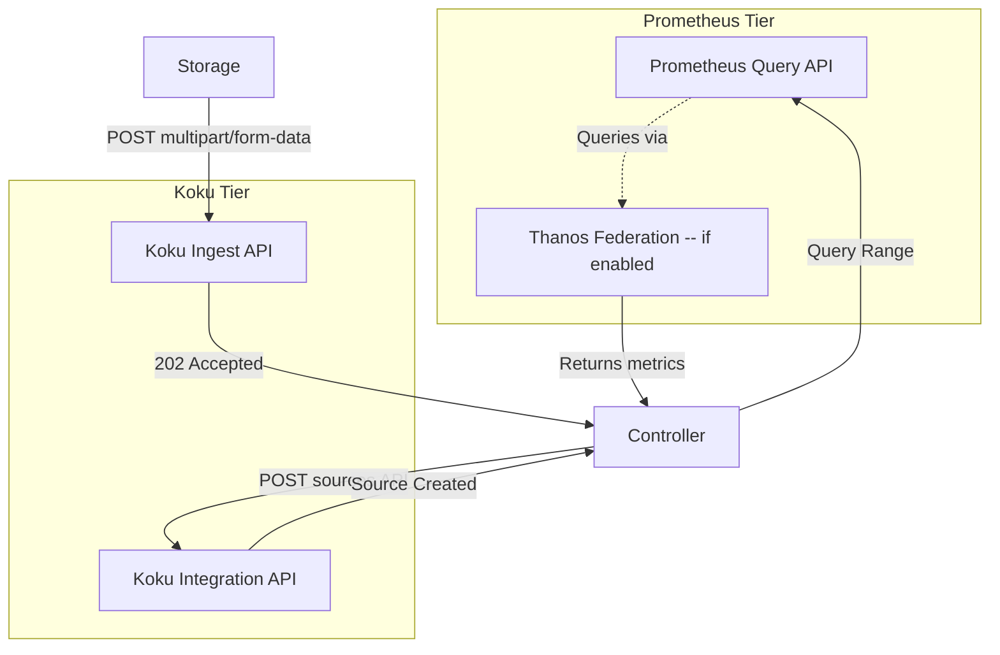

# External Components Architecture

## System Overview



## Component Details

### 1. Prometheus/Thanos Connection Flow



### 2. Authentication Flow



### 3. Reporting Cycle



### 4. Data Flow with External APIs



## External Dependencies

| Component | Purpose | Configuration Location |
|-----------|---------|----------------------|
| **Prometheus** | Metrics query endpoint | `spec.prometheusConfig.svcAddress` |
| **Thanos** | Long-term storage federation | Configured via Prometheus URL |
| **console.redhat.com** | Koku API for uploads | `spec.upload.apiURL` |
| **openshift-config/v1** | ClusterVersion CR | Auto-discovered |
| **ConfigMaps** | Monitoring config, TLS certs | `openshift-monitoring/cluster-monitoring-config` |
| **ServiceAccounts** | Token authentication | `openshift-config/pull-secret` |

## Environment Variables (External)

```bash
# Authentication
IN_CLUSTER=true/false          # Use in-cluster storage
WATCH_NAMESPACE=<ns>           # Namespace to watch (all if empty)

# Leader Election
LEADER_ELECTION_LEASE_DURATION=60s
LEADER_ELECTION_RENEW_DEADLINE=30s
LEADER_ELECTION_RETRY_PERIOD=5s

# Secrets Path
SECRET_ABSPATH=/path/to/secrets # Override default SA path
```

## Key External Interfaces

### Prometheus Query API
- **Endpoint**: Configured via `spec.prometheusConfig.svcAddress`
- **Auth**: ServiceAccount token (Bearer) or CA certificate
- **Queries**: Range queries for hourly metrics collection
- **Timeout**: Configurable via `spec.prometheusConfig.contextTimeout`

### Koku Upload API
- **Endpoint**: `spec.upload.apiURL + spec.upload.ingressAPIPath`
- **Auth**: Bearer token, Basic auth (deprecated), or ServiceAccount
- **Format**: Multipart form-data with tar.gz packages
- **Retry**: Exponential backoff on 4xx/5xx errors

### OpenShift Cluster APIs
- **ClusterVersion**: Read-only CR for cluster identity
- **ConfigMaps**: Monitoring configuration and certificates
- **Secrets**: Pull secret, auth credentials, service accounts
