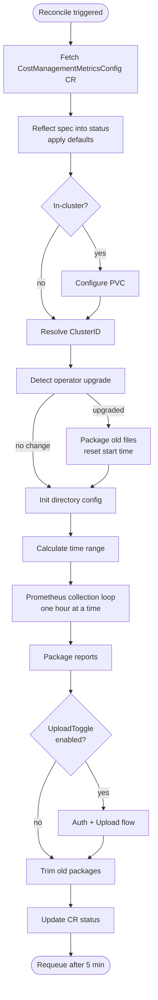

# Reconcile Loop

Every reconcile is triggered by a change to `CostManagementMetricsConfig` or by a requeue
(every 5 minutes on success, exponential back-off on error via `SetupWithManager` at
[controller.go:921](../internal/controller/costmanagementmetricsconfig_controller.go)).



---

## Step by step

### 1. Fetch the CR

`Reconcile()` at line 745 in [costmanagementmetricsconfig_controller.go](../internal/controller/costmanagementmetricsconfig_controller.go)

The reconciler fetches the `CostManagementMetricsConfig` CR by name/namespace. If it is not
found (e.g. deleted), the error is ignored and reconciliation stops — nothing to act on.
A deep copy is made immediately so the original can be diffed against the mutated copy for
status updates later.

---

### 2. Reflect spec into status, apply defaults

`ReflectSpec()` at line 122 in [costmanagementmetricsconfig_controller.go](../internal/controller/costmanagementmetricsconfig_controller.go)

The CR's spec fields are copied into the status sub-resource, filling in defaults for anything
left unset. Key defaults (defined in [defaults.go](../api/v1beta1/defaults.go)):

| Field                  | Default                                                  |
|------------------------|----------------------------------------------------------|
| `APIURL`               | `https://console.redhat.com`                             |
| `IngressAPIPath`       | `/api/ingress/v1/upload`                                 |
| `SourcesAPIPath`       | `/api/sources/v1.0/`                                     |
| `TokenURL`             | `https://sso.redhat.com/.../token`                       |
| `PrometheusSvcAddress` | `https://thanos-querier.openshift-monitoring.svc:9091`   |
| `UploadCycle`          | 360 min                                                  |
| `SourceCheckCycle`     | 1440 min (24 h)                                          |
| `UploadWait`           | random 0–34 s jitter                                     |

`UploadCycle` is clamped to a minimum of 60 minutes (line 158).

---

### 3. Configure PVC (in-cluster only)

`configurePVC()` at line 615 in [costmanagementmetricsconfig_controller.go](../internal/controller/costmanagementmetricsconfig_controller.go)
| [storage.go](../internal/storage/storage.go)

Skipped when running outside a cluster (local dev). Otherwise:

- If `spec.volumeClaimTemplate` is set, that PVC spec is used; otherwise the default
  10 Gi `ReadWriteOnce` PVC named `costmanagement-metrics-operator-data` is created.
- The operator's `Deployment` is patched to mount the PVC at the report directory.
- If the deployment was just re-mounted, reconciliation returns early to let the pod
  restart before continuing — the next reconcile picks up where this one stopped.

---

### 4. Resolve ClusterID

`setClusterID()` / `GetClusterID()` at line 377 in [costmanagementmetricsconfig_controller.go](../internal/controller/costmanagementmetricsconfig_controller.go)
| [cv.go](../internal/clusterversion/cv.go)

Reads the cluster-scoped `ClusterVersion` resource (OpenShift-specific) to extract:

- `spec.clusterID` — a UUID that uniquely identifies this OCP cluster; used as the default
  source name and stamped into every uploaded payload.
- `spec.channel` — the OCP update channel (e.g. `stable-4.14`), stored as `ClusterVersion`
  in status.

Failure here is fatal for the reconcile cycle — there is no meaningful payload without a
cluster ID.

---

### 5. Detect operator upgrade

`setOperatorCommit()` at line 494 in [costmanagementmetricsconfig_controller.go](../internal/controller/costmanagementmetricsconfig_controller.go)

The operator binary embeds its git commit hash in the `GitCommit` variable (injected at
build time via the `GIT_COMMIT` env var). On each reconcile this is compared with
`cr.Status.OperatorCommit`.

If they differ, this is either a fresh install or an upgrade. Because a new operator version
may produce CSV files with different columns or structure, any existing unpackaged report
files are packaged immediately before new collection starts. The collection start time is
then truncated to the beginning of today so the fresh version re-collects the full current
day.

---

### 6. Init directory config

`dirCfg.GetDirectoryConfig()` at line 803 in [costmanagementmetricsconfig_controller.go](../internal/controller/costmanagementmetricsconfig_controller.go)
| [dirconfig.go](../internal/dirconfig/dirconfig.go)

Sets up (or verifies) the directory layout under the PVC mount point:

```
/tmp/cost-mgmt-operator-reports/   (or PVC mount)
├── reports/    ← raw per-hour CSV files written by the collector
└── upload/     ← packaged tar.gz archives ready to upload
```

The config is cached across reconcile cycles; `CheckConfig()` validates the paths still
exist before reusing them.

---

### 7. Calculate time range

`getTimeRange()` at line 86 in [prometheus.go](../internal/controller/prometheus.go)

Determines the `[start, end)` window of hours to collect. The basic case is "the previous
full hour", but there are three important variations:

**Initial / previous-data collection** (`spec.prometheusConfig.collectPreviousData: true`):
On the very first reconcile (no `LastQuerySuccessTime`), start is pushed back by the
Prometheus retention period. The retention is read from the
`openshift-monitoring/cluster-monitoring-config` ConfigMap (line 45 in prometheus.go);
it defaults to 14 days and is capped at 90 days.

**Gap recovery**: If `LastQuerySuccessTime` is more than one hour behind the current hour,
the operator resumes from where it left off (up to the retention limit). This handles
periods where the operator was down or Prometheus was unreachable.

**Normal operation**: Start = previous full hour, end = start + 59m59s.

---

### 8. Prometheus collection loop

`collectPromStats()` at line 162 in [prometheus.go](../internal/controller/prometheus.go)
| `GenerateReports()` in [collector.go](../internal/collector/collector.go)

For each hour in `[start, end]`, the operator:

1. Skips the hour if `LastQuerySuccessTime` already covers it (idempotent).
2. Calls `collector.GenerateReports()`, which executes all PromQL queries against
   `thanos-querier` and writes the results as CSV rows (one file per metric type per hour).
3. On success, advances `LastQuerySuccessTime` and clears the retry counter.
4. On failure, increments a per-hour retry counter; after 5 consecutive failures the hour is
   abandoned and collection moves on.
5. Special case during initial collection: if an entire day has no data (hour 0 returns
   `ErrNoData`), the day is skipped to avoid producing a partial daily report.

Every 96 hours during initial collection, an intermediate package is created to avoid
accumulating too many open files (line 862 in the controller).

See [exploration.md — Prometheus Collection](./exploration.md#prometheus-collection--csv-reports)
for a breakdown of which queries produce which CSV files.

---

### 9. Package reports

`packageFilesWithCycle()` / `packageFiles()` at line 529 in [costmanagementmetricsconfig_controller.go](../internal/controller/costmanagementmetricsconfig_controller.go)
| [packaging.go](../internal/packaging/packaging.go)

Compresses CSV files from `reports/` into `upload/*.tar.gz` archives. Each archive contains:

- All CSV files that fit within `spec.packaging.maxSize` (default 100 MB).
- A `manifest.json` with a UUID, cluster ID, creation timestamp, and list of included files.

If end-of-day has been reached (hour == 23), files are **moved** out of `reports/` (no more
appending). At other times within the upload cycle they are **copied**, leaving the originals
in place so the collector can keep appending rows to them.

Packaging only runs when `UploadCycle` minutes have elapsed since the last successful
package — except at end-of-day, which always triggers it.

---

### 10. Auth + Upload flow

`setAuthAndUpload()` at line 655 in [costmanagementmetricsconfig_controller.go](../internal/controller/costmanagementmetricsconfig_controller.go)

Skipped entirely when `spec.upload.uploadToggle` is `false` (disconnected / restricted-network
clusters that collect reports for manual export).

When enabled, this calls in sequence:

**a. Resolve credentials** — `setAuthentication()` at line 386

| Auth type             | Where credentials come from                                               |
|-----------------------|---------------------------------------------------------------------------|
| `token` (default)     | `pull-secret` in `openshift-config` namespace, key `cloud.openshift.com`  |
| `service-account`     | Secret in operator namespace with `client_id` + `client_secret` keys      |
| `basic` (deprecated)  | Secret in operator namespace with `username` + `password` keys            |

For `service-account`, the credentials are exchanged for a short-lived Bearer token via
`POST` to `spec.authentication.tokenURL` —
`GetAccessToken()` at line 66 in [config.go](../internal/crhchttp/config.go).

**b. Validate credentials** — `validateCredentials()` at line 440

- `token` auth: skipped (the pull-secret is trusted).
- `service-account`: token exchange in step (a) is the validation.
- `basic`: a `GET /api/sources/v1.0/sources` is made and cached for 1440 min to avoid
  hammering the API on every reconcile.

**c. Source check** — `checkSource()` at line 506 in [costmanagementmetricsconfig_controller.go](../internal/controller/costmanagementmetricsconfig_controller.go)
| [handler.go](../internal/sources/handler.go)

Verifies that an OpenShift integration (source) exists in console.redhat.com's Sources API.
Runs every `CheckCycle` minutes (default 1440) or immediately when `spec.source` changes.
If the source is missing and `spec.source.createSource` is `true`, it is created via
`POST /api/sources/v1.0/sources` followed by an application association.

**Upload is blocked until a valid source exists.** Files accumulate in `upload/` until
the integration is confirmed.

**d. Upload** — `uploadFiles()` at line 566 in [costmanagementmetricsconfig_controller.go](../internal/controller/costmanagementmetricsconfig_controller.go)
| `Upload()` at line 156 in [http_cloud_dot_redhat.go](../internal/crhchttp/http_cloud_dot_redhat.go)

Each `upload/*.tar.gz` is POSTed as `multipart/form-data` to
`${APIURL}/api/ingress/v1/upload`. A random jitter (`UploadWait`, 0–34 s) is applied
before the first upload to spread load from many clusters reconciling at the same time.

On HTTP 202, the local tar.gz is deleted and `LastSuccessfulUploadTime` is recorded.
On HTTP 401, credentials are re-validated immediately. Other errors are logged and the file
is kept for the next cycle.

---

### 11. Trim old packages

`packager.TrimPackages()` at line 898 in [costmanagementmetricsconfig_controller.go](../internal/controller/costmanagementmetricsconfig_controller.go)

After upload, if the number of files in `upload/` exceeds `spec.packaging.maxReports`
(default: no hard limit, configurable), the oldest archives are deleted to keep disk usage
bounded.

---

### 12. Update CR status and requeue

Line 910 in [costmanagementmetricsconfig_controller.go](../internal/controller/costmanagementmetricsconfig_controller.go)

`r.Status().Update()` writes the mutated status back to the API server. This is the only
place status is persisted — all intermediate changes during a reconcile cycle are in-memory
only.

The reconciler then returns `RequeueAfter: 5m`. If any step returned an error, the result
is cleared (`ctrl.Result{}`) and the error is returned instead, which causes
controller-runtime to requeue with exponential back-off (5 s initial, 5 min ceiling).