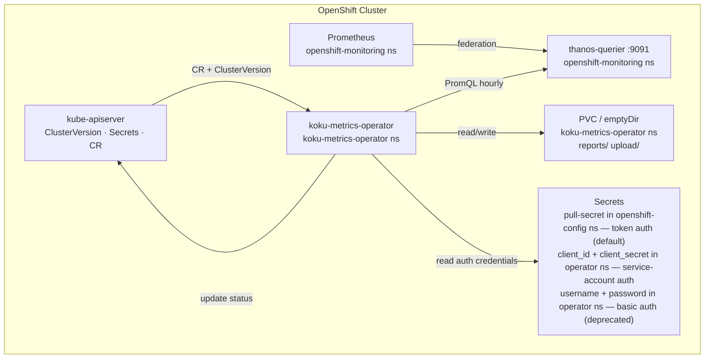
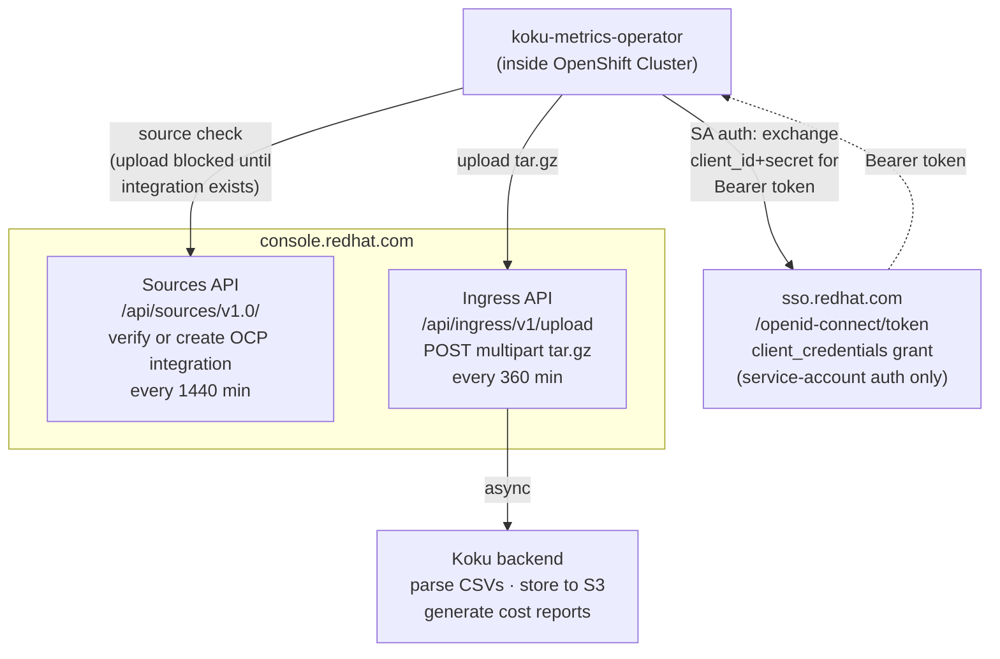
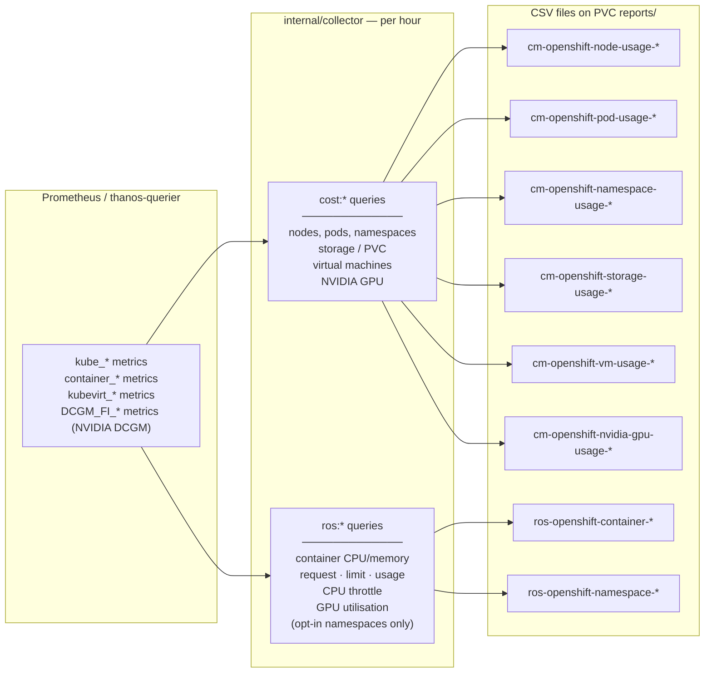
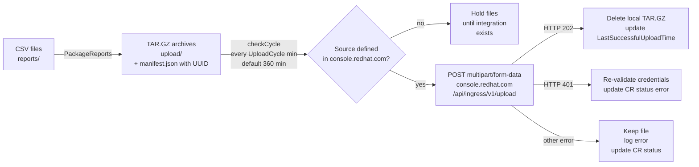
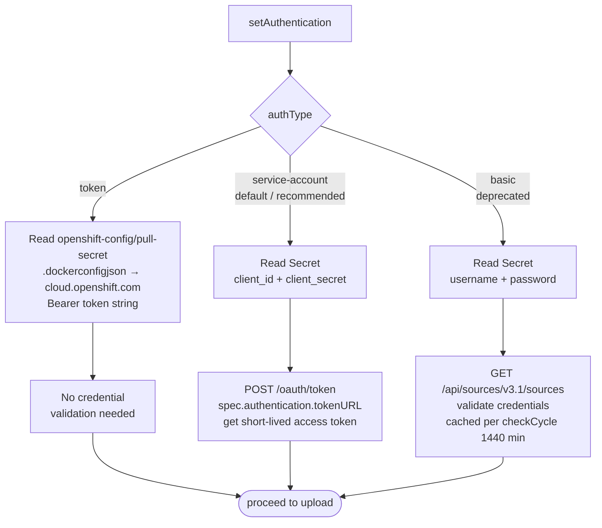
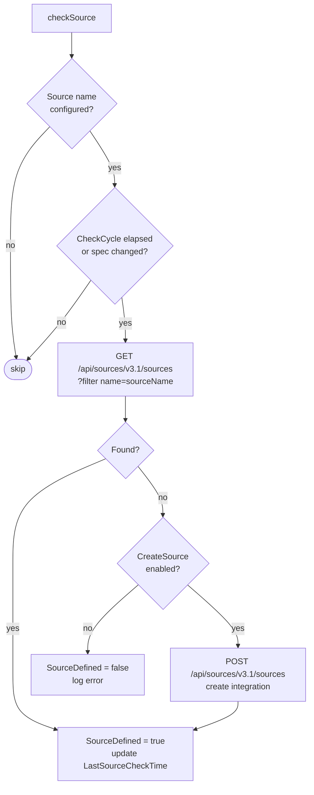

# Koku Metrics Operator — Flow Diagrams

## System Components — In-cluster

## System Components — External connections

---

## Reconcile Loop

See [exploration-reconcile.md](./exploration-reconcile.md) for the full diagram and step-by-step description.

---

## Prometheus Collection → CSV Reports

For each hour in the time range the operator queries thanos-querier and writes one row per metric series to CSV files on the PVC.

ROS data collection is opt-in: namespaces must carry the label `insights_cost_management_optimizations=true` or `cost_management_optimizations=true`.

---

## Packaging & Upload Pipeline

---

## Authentication Flow

Three auth types are supported. The type is set in `spec.authentication.authType`.

---

## Source (Integration) Check

Before uploading, the operator verifies that an integration (source) exists in console.redhat.com. This runs every `CheckCycle` minutes (default 1440 min = 24 h) or immediately when `spec.source` changes.

